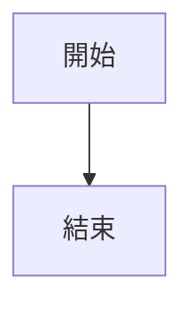

# Markdown 是什麼?

Markdown 是一種「輕量級標記語言」。

簡單來說：

你只要打普通文字 加 一些符號，

就能快速做出：

- 標題

- 粗體

- 清單

- 表格

- 程式碼區塊

- 文件排版

而且不用像 HTML 一樣打一大堆標籤。
以下為使用範例

---

## 標題

```Markdown
# H1
```

預覽：

# H1

---

```Markdown
## H2
```

預覽：

## H2

---

```Markdown
### H3
```

預覽：

### H3

---

```Markdown
#### H4
```

預覽：

#### H4

---

```Markdown
##### H5
```

預覽：

##### H5

---

```Markdown
###### H6
```

預覽：

###### H6

---

## 文字樣式

```Markdown
**粗體**
```

預覽：

**粗體**

---

```Markdown
*斜體*
```

預覽：

*斜體*

---

```Markdown
***粗斜體***
```

預覽：

***粗斜體***

---

```Markdown
~~刪除線~~
```

預覽：

~~刪除線~~

---

```Markdown
<u>底線</u>
```

預覽：

<u>底線</u>

---

## 引用

```Markdown
> 引用文字
```

預覽：

> 引用文字

---

```Markdown
>> 第二層引用
```

預覽：

>> 第二層引用

---

```Markdown
>>> 第三層引用
```

預覽：

>>> 第三層引用

---

## 清單

```Markdown
- 項目1
- 項目2
- 項目3
```

預覽：

- 項目1
- 項目2
- 項目3

---

```Markdown
1. 第一個
2. 第二個
3. 第三個
```

預覽：

1. 第一個
2. 第二個
3. 第三個

---

## 任務清單

```Markdown
- [ ] 未完成
- [x] 已完成
```

預覽：

- [ ] 未完成
- [x] 已完成

---

## 行內程式碼

```Markdown
`行內程式碼`
```

預覽：

`行內程式碼`

---

## 程式碼

一行的用"```"  
兩行用"```"  
  
  
````Markdown
(````)js
console.log("Hello")
console.log("Test")
(```)
````
把掛號去掉即可
---

## 分隔線

```Markdown
---
```

預覽：

---

```Markdown
***
```

預覽：

***


```Markdown
___
```

預覽：

___


## 連結

```Markdown
[Google](https://google.com)
```

預覽：

[Google](https://google.com)

---

```Markdown
https://google.com
```

預覽：

https://google.com

---

## 圖片

```Markdown

```

```Markdown

```


預覽：


---

## HTML 圖片大小

```Markdown
(<(img src="image.png" width="200")>)
```

把括號去掉即可，因為顯示問題

```Markdown

```

預覽：


---

## 表格

```Markdown
| 名字 | 年齡 |
|---|---|
| Alex | 20 |
| Sam | 18 |
```

預覽：

| 名字 | 年齡 |
|---|---|
| Alex | 20 |
| Sam | 18 |

---

## 表格對齊

```Markdown
| 左對齊 | 置中 | 右對齊 |
|:---|:---:|---:|
| A | B | C |
```

預覽：

| 左對齊 | 置中 | 右對齊 |
|:---|:---:|---:|
| A | B | C |

---

## HTML 混用

```Markdown
<div align="center">

# 置中文字

</div>
```

預覽：

<div align="center">

# 置中文字

</div>

---

## 摺疊區塊（GitHub 支援）

```Markdown
<details>
<summary>點我展開</summary>

隱藏內容

</details>
```

預覽：

<details>
<summary>點我展開</summary>

隱藏內容

</details>

---

## GitHub 提示框 (在這用不了)

```Markdown
> [!NOTE]
> 提示內容
```

預覽：

> [!NOTE]
> 提示內容

---

```Markdown
> [!TIP]
> 小技巧
```

預覽：

> [!TIP]
> 小技巧

---

```Markdown
> [!WARNING]
> 警告內容
```

預覽：

> [!WARNING]
> 警告內容

---

```Markdown
> [!IMPORTANT]
> 重要內容
```

預覽：

> [!IMPORTANT]
> 重要內容

---

```Markdown
> [!CAUTION]
> 危險內容
```

預覽：

> [!CAUTION]
> 危險內容

---

## 鍵盤按鍵

```Markdown
<kbd>Ctrl</kbd> + <kbd>C</kbd>
```

預覽：

<kbd>Ctrl</kbd> + <kbd>C</kbd>

---

## 上標與下標

```Markdown
H<sub>2</sub>O
```

預覽：

H<sub>2</sub>O

---

```Markdown
X<sup>2</sup>
```

預覽：

X<sup>2</sup>

---

## 跳脫字元

```Markdown
\*不是斜體\*
```

預覽：

\*不是斜體\*

---

```Markdown
\#不是標題
```

預覽：

\#不是標題

---

## Mermaid（GitHub/HackMD 支援）

````Markdown
